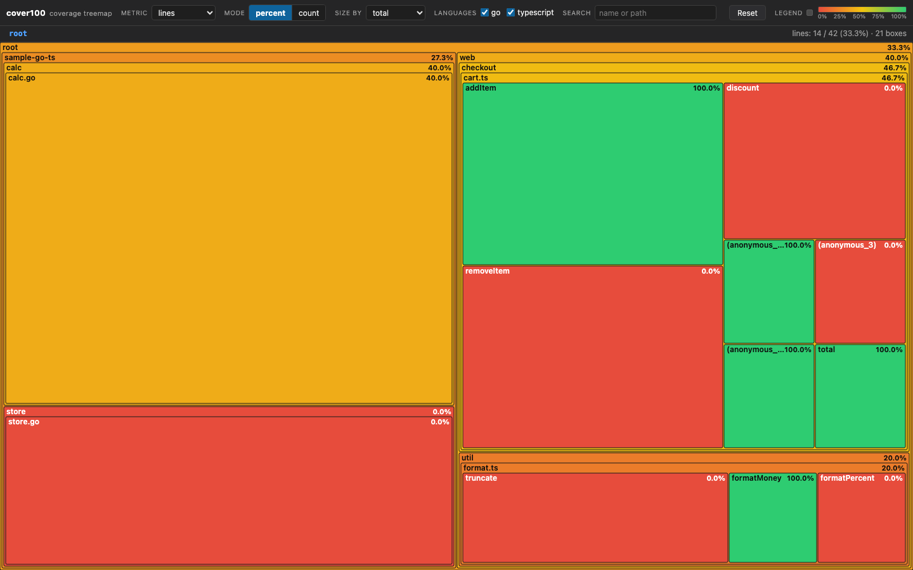

# cover100

**See where your tests actually reach.** `cover100` collects test coverage from
Go and TypeScript/JavaScript projects, normalizes it into one JSON document, and
opens a zoomable treemap of it in your browser. Nothing is uploaded, and no
server is left running behind you.

```console
$ cover100
```

One command, one report, one picture: every repository, package, file and
function, sized by how much code it holds and coloured by how much of it your
tests reach.



## Why a treemap

A coverage percentage is a single number that hides where the risk is. A table
of per-package percentages tells you *that* something is uncovered but not how
much surface that represents. The treemap answers both questions at once: box
**area** is volume and box **colour** is coverage, so the largest red box is the
biggest untested surface in the codebase, and it is impossible to miss.

## Install

```console
# Go 1.26 or newer
go install github.com/sneat-dev/cover100-cli/cmd/cover100@latest

# or from a checkout
git clone https://github.com/sneat-dev/cover100-cli
cd cover100-cli && make install
```

`make install` builds the binary as `cover100`. Installing straight from the
module root directory would name the binary `cover100-cli`, which is why the
documented path points at `./cmd/cover100`.

Prebuilt binaries for macOS, Linux and Windows (amd64 and arm64) are attached to
each [release](https://github.com/sneat-dev/cover100-cli/releases). An installed
release binary can update itself:

```console
$ cover100 self-update
```

Collection itself needs the toolchains it measures: the `go` command for Go
modules, and Node with the project's own test runner installed for
TypeScript/JavaScript packages.

## Usage

```console
cover100 [path] [flags]
```

`path` defaults to the current directory, so a bare `cover100` in the repository
you care about does the right thing. It finds every Go module (`go.mod`) and
every Node package with a `test` script (`package.json`) beneath that path —
including several in one tree — collects coverage from each, and writes a single
report.

| Flag | Default | Meaning |
|---|---|---|
| `--out` | `.cover100/coverage.json` | where the report JSON is written |
| `--open` / `--no-open` | open | whether to open the report in a browser |
| `--lang` | `all` | `go`, `ts`, `js` or `all`; `ts` and `js` restrict collection by file extension, `go` restricts to Go projects |
| `--metric` | `lines` | metric the treemap opens on |
| `--mode` | `percent` | `percent` or `count` |
| `--port` | `5173` | preferred port for the local static server |
| `--keep` | `false` | keep intermediate coverage artefacts |
| `--no-serve` | `false` | write the report and exit without starting a server |
| `--file` | `false` | open the self-contained report over `file://` |
| `--timeout` | `15m` | timeout for each project's coverage command |
| `--format` | `text` | `text` or `json` |
| `--verbose` | `false` | verbose diagnostic logging |

`--metric` and `--mode` are passed through to the page, so the CLI's default and
the UI's initial state cannot disagree.

### Run modes

| Mode | What happens |
|---|---|
| default | writes the report, serves it on loopback, opens the page, and stays up until `Ctrl+C` |
| `--no-serve` | writes the report and exits — for CI and scripting |
| `--file` | writes a self-contained HTML file and opens it over `file://`, starting no server |
| `--no-open` | still serves and prints the URL, without launching a browser |

`Ctrl+C` (or `SIGTERM`) terminates any coverage command still running, shuts the
server down and exits `130`.

### Exit codes

| Code | Meaning |
|---|---|
| `0` | the report was written — including a run with collection warnings |
| `2` | invalid arguments |
| `3` | the scan path does not exist, or holds no supported project |
| `10` | unexpected runtime failure |
| `130` | interrupted |

Partial failures are warnings, not failures: a Go module whose tests fail, or a
Node package whose coverage reporter never ran, contributes what it can and the
rest of the run continues. Every warning appears on stderr **and** inside the
report's `warnings` array, so a CI job that only reads the JSON still sees them.

`--format json` writes one machine-readable summary to stdout and nothing else —
progress moves to stderr — so the command is safe to pipe:

```console
$ cover100 . --no-serve --format json | jq '.metrics[] | select(.metric=="lines")'
{
  "metric": "lines",
  "covered": 27,
  "total": 62,
  "percent": 0.43548387096774194
}
```

## Reading the treemap

The boxes nest as **repository → package → file → function**.

- **Size** comes from the selected metric. In `percent` mode the *size by*
  control switches between total volume and **uncovered volume** — the latter
  re-weights the map so the biggest boxes are the biggest problems rather than
  the biggest files.
- **Colour** always encodes the coverage percentage of the selected metric:
  red at 0%, amber at 50%, green at 100%, on the scale
  `d3.scaleLinear().domain([0, 0.5, 1]).range(['#e74c3c', '#f1c40f', '#2ecc71'])`.
  A grey box is not 0% — it is a dimension that was never measured.
- **Click** a box to drill in; the breadcrumb walks back out one level per
  click, and `Esc` does the same from the keyboard.
- **Hover** for the full breakdown: name, type, language, path relative to the
  repository, every metric as `covered / total (xx.x%)`, and — for a function —
  its line number and hit count. Hovering also outlines the ancestors of a box,
  which is how you keep your bearings in a deep tree.
- **Search** dims everything that does not match and outlines what does.
- **Right-click** a box, or use *Copy path* in the tooltip, to copy its
  repository-relative path.
- The **language checkboxes** prune the tree. The numbers on the remaining boxes
  are then recomputed over exactly what is visible, so a filtered map never
  shows a repository's whole-tree percentage next to one language's boxes.

### Opening the report without a server

A browser refuses `fetch()` against `file://` URLs. With `--file`, `cover100`
writes a single self-contained HTML document next to the report — the same
stylesheet, script and data inlined — so the treemap works with no server at
all. Both forms are generated from the same source files, so they cannot
disagree.

The viewer loads D3 from
`https://cdn.jsdelivr.net/npm/d3@7`. Served locally that is a normal request; if
you open the standalone document offline, the page says so plainly instead of
rendering an empty canvas.

## The report format

The report is one JSON document. `metrics` and `languages` are arrays; every
tree node carries all five metric objects, each `{covered, total}`.

```json
{
  "generatedAt": "2026-09-14T12:00:00Z",
  "root": "/path/to/scan",
  "metrics": ["lines", "functions", "files", "packages", "repositories"],
  "languages": ["go", "typescript"],
  "tree": {
    "id": "root", "name": "root", "type": "root", "language": null,
    "lines":         { "covered": 450, "total": 600 },
    "functions":     { "covered": 32,  "total": 40  },
    "files":         { "covered": 12,  "total": 14  },
    "packages":      { "covered": 3,   "total": 4   },
    "repositories":  { "covered": 1,   "total": 1   },
    "children": [
      {
        "id": "repo:my-app", "name": "my-app", "type": "repository",
        "language": "typescript", "path": ".",
        "lines": { "covered": 450, "total": 600 },
        "children": [
          {
            "id": "pkg:my-app/src/checkout", "name": "checkout", "type": "package",
            "language": "typescript", "path": "src/checkout",
            "lines": { "covered": 120, "total": 160 },
            "children": [
              {
                "id": "file:my-app/src/checkout/cart.ts", "name": "cart.ts", "type": "file",
                "language": "typescript", "path": "src/checkout/cart.ts",
                "lines": { "covered": 80, "total": 100 },
                "children": [
                  {
                    "id": "fn:my-app/src/checkout/cart.ts#addItem@42",
                    "name": "addItem", "type": "function", "language": "typescript",
                    "line": 42, "hits": 8, "covered": true,
                    "lines": { "covered": 5, "total": 5 },
                    "functions": { "covered": 1, "total": 1 }
                  }
                ]
              }
            ]
          }
        ]
      }
    ]
  }
}
```

A full example, generated from [`examples/sample-go-ts`](examples/README.md), is
committed at [`examples/coverage.example.json`](examples/coverage.example.json).
Nodes also carry `path`, `functionsAvailable`, `branches`, and — on functions —
`line`, `hits` and `covered`. The document additionally carries `warnings` and
`tool`; consumers that only understand the keys above can ignore them.

### Node ids

Ids are stable and globally unique, built from paths relative to the scan root:

| Node | Id |
|---|---|
| repository | `repo:<dir>` |
| package | `pkg:<dir>` |
| file | `file:<path>` |
| function | `fn:<path>#<name>@<line>` |

Line-level nodes are deliberately **not** materialized: per-line detail is
aggregated into the file and function metrics. Materializing every line would
multiply the document size for detail the treemap cannot show anyway.

### How the metrics roll up

- `lines`, `functions` and `files` are element-wise sums of a node's children.
- A **file** node reports its own measured line and function counts. Its
  function children own only the statements inside a function body, so summing
  them would undercount top-level code.
- A **package** node's `packages` and `repositories` are `{1, 1|0}`: the package
  itself and the repository containing it, each counting as covered when any
  line inside it is.
- A **repository** node's `packages` counts its direct package children that
  contain at least one covered line.
- The **root** node's `packages` sums its repositories' `packages`, and its
  `repositories` counts its repository children that contain at least one
  covered line.
- Children are sorted by `lines.total` descending, then `functions.total`, then
  name, so two runs over the same tree produce byte-identical reports.

## How collection works

### Go

For every detected module, cover100 runs:

```console
go test -coverprofile=<workdir>/go-<n>.out ./...
```

and parses the profile directly — no `gocov`, no conversion step. Each record is
`file:startLine.startCol,endLine.endCol numStmts count`; a block is expanded
across its line range, a line covered by several blocks keeps the highest count,
`lines.total` counts the distinct lines referenced and `lines.covered` counts
those with a count above zero. `_test.go` files are excluded from the report.

A failing `go test` does not abort the run: whatever profile Go managed to write
is still parsed, and the failure is recorded as a warning.

### TypeScript and JavaScript

For every `package.json` with a non-empty `test` script, cover100 picks the
runner from the package's dependencies (or, failing that, from the test script
itself), preferring `vitest` then `jest`, and prefers the package's **own**
`node_modules/.bin/<runner>` over `npx` so the version the project pinned is the
version that runs:

```console
# vitest
vitest run --coverage.enabled=true --coverage.reporter=json --coverage.reportsDirectory=<dir>
# jest
jest --coverage --coverageReporters=json --coverageDirectory=<dir>
```

`coverage-final.json` (Istanbul) is parsed for lines (`statementMap` + `s`),
functions (`fnMap` + `f`) and branches (`branchMap` + `b`). A statement belongs
to the innermost function whose body contains it, which is how a function node
reports its own line coverage. When only `lcov.info` was written, cover100 falls
back to its `DA`, `FN`, `FNDA` and `BRDA` records.

## Limitations

These are properties of the toolchains, not oversights, and cover100 surfaces
each of them rather than papering over it.

- **Go function coverage is not available.** Go's cover profiles contain
  statement blocks only — there is no function table to read. Every Go file
  therefore reports `functions: {covered: 0, total: 0}` with
  `functionsAvailable: false`, and both the CLI summary and the tooltip say
  *not measured*. Do not read `0 / 0` as zero coverage. The treemap's function
  metric is meaningful for TypeScript/JavaScript and for mixed trees.
- **Function line counts from `lcov` are not attributable.** `lcov` records a
  function's declaration line and hit count but no body range, so functions
  parsed from the lcov fallback report their lines as `0 / 0` while still
  reporting correct hit counts.
- **Anonymous functions are the provider's granularity, not cover100's.** A
  class's field initializers are compiled into functions that the v8 coverage
  provider reports without a name, so they appear in the *functions* metric as
  `(anonymous_1)`, `(anonymous_2)`, and so on. They are real entries in the
  provider's `fnMap`, and cover100 surfaces them rather than hiding them.
- **`lines` granularity follows the coverage provider.** For TypeScript and
  JavaScript the line set is whatever the runner's reporter emits: the v8
  provider reports statement-level lines, while other reporters (and older
  versions of the same one) emit a coarser line map for the same file. Compare
  like with like across runs, and expect a dependency bump to shift the
  denominator.
- **Go lines are not statements.** `lines.covered / lines.total` counts distinct
  source lines that appear in the profile, while `go test` itself reports
  statement coverage. The two numbers will differ slightly; cover100 reports
  what the profile actually contains.
- **A Go package that fails to build drops out of the profile.** `go test`
  reports packages with no test files (as 0%), but a package excluded by build
  tags or one that does not compile is absent — which shrinks the denominator.
  Watch the warnings.
- **Runner coverage providers must be installed.** `vitest` needs
  `@vitest/coverage-v8` (or `-istanbul`); jest needs its coverage provider. If
  neither is present the runner writes no report, and cover100 warns and skips
  that package rather than reporting 0%.
- **A monorepo runs every package that declares a test script.** If a workspace
  root has a `test` script that runs its children, the root and the children are
  both collected and the same files can appear twice, under different repository
  nodes. Scope with `--lang` or run cover100 from the package you care about.
- **`--lang ts` and `--lang js` filter by file extension**, so a TypeScript
  project with a few plain `.js` files reports only the matching half when you
  restrict to one.
- **The viewer needs the D3 CDN.** The page is a static document with no build
  step; D3 comes from jsDelivr.

## Development

```console
make build     # compile ./cover100
make install   # install to GOBIN as `cover100`
make test      # go test ./...
make cover     # enforce the 100% statement-coverage floor CI enforces
make vet
make fmt
make spec-lint # validate the SpecScore tree
make demo      # regenerate examples/coverage.example.json
```

The layout follows the fleet's Go CLIs: the command surface lives in
`internal/cli`, one verb per file, and everything else is a package with a
single responsibility.

```
cover100-cli/
├── assets.go              # go:embed of the viewer, so the binary is self-contained
├── cmd/cover100/          # main
├── internal/
│   ├── cli/               # cobra/fang command tree, flags, run modes
│   ├── detect/            # find Go modules and Node packages
│   ├── executil/          # cancellable child processes (process-group kill)
│   ├── gocov/             # run `go test`, parse the cover profile
│   ├── tscov/             # run jest/vitest, parse Istanbul and lcov
│   ├── aggregate/         # build the tree and roll the metrics up
│   ├── model/             # the normalized, language-neutral model
│   ├── serve/             # loopback static server and browser launch
│   ├── view/              # the self-contained file:// document
│   ├── pathutil/          # symlink-aware relative paths
│   └── ui/                # terminal styling, wired to strongo/logus
├── pkg/exitcode/          # exit-code vocabulary
├── public/                # the treemap page: index.html, app.js, styles.css
├── examples/              # a small Go + TypeScript fixture and its report
├── spec/                  # the SpecScore specification this code implements
└── docs/
```

Statement coverage is 100% across every package, and CI fails below it. That
floor is only honest because platform-specific behaviour lives in build-tagged
files (`internal/serve/browser_darwin.go`, `internal/tscov/runner_suffix_windows.go`)
rather than in a `switch runtime.GOOS` inside shared code: `GOOS` is a
compile-time constant, so on any one platform the other arms are dead code the
coverage tool would still count against the denominator. Each platform's CI job
covers its own file.

It is built on the shared tooling rather than hand-rolled equivalents:
`spf13/cobra` fronted by `charm.land/fang/v2` through
`github.com/strongo/buildinfo/fangcmd`, version identity from
`github.com/strongo/buildinfo`, diagnostics through `github.com/strongo/logus`,
and `self-update` from `github.com/strongo/cli-helpers/selfupdate`.

### Specification

The behaviour in this README is specified, requirement by requirement, in
[`spec/features/`](spec/features/README.md) as SpecScore artifacts. `make
spec-lint` gates them in CI, so the specification and this document are checked
against each other rather than trusted to stay in sync.

## License

Apache-2.0 — see [LICENSE](LICENSE).
